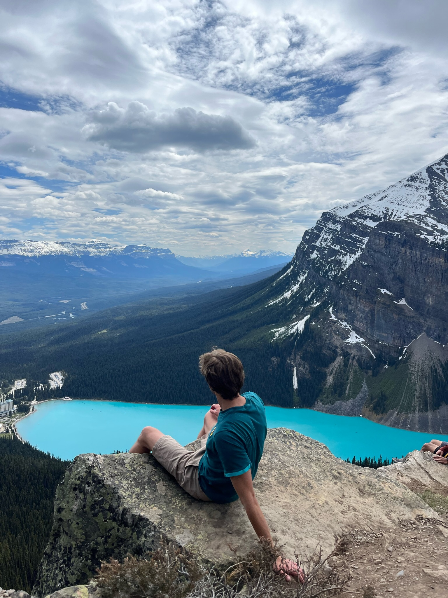

---
hide:
  - toc
---

# Welcome to my homepage

<figure style="float: right; width: 30%;">
  
  <figcaption>This is me at Lake Louise, Canada.</figcaption>
</figure>

Hello! I'm a mathematician and PhD candidate at Case Western Reserve University. Currently, I'm also a summer RA at [*topos institute*](https://topos.institute). I'm interested in exploring ideas in double category theory. In particular, I want to understand notions of presentable double categories, compact closed double categories and their use in answering questions in category theory and other areas of mathematics. Beyond this, I am drawn to all ideas that explore the search for truth and the beauty it reveals.

Here, you'll find:

- **About me**: A description of my given talks, papers and events I helped organize.
- **Conversations with friends**: I like thinking about things and having long conversations with others about things. In this section I want to keep a record of some of the things thought and conversated.

If you find something here that resonates with you, feel free to reach out to me at **axh1127 [at] case [dot] edu**.

## Friends

[*Sebastian Gómez Rendón*](https://sites.google.com/view/sebasgomez)

[*Shiv Mauree*](https://smauree.com)

