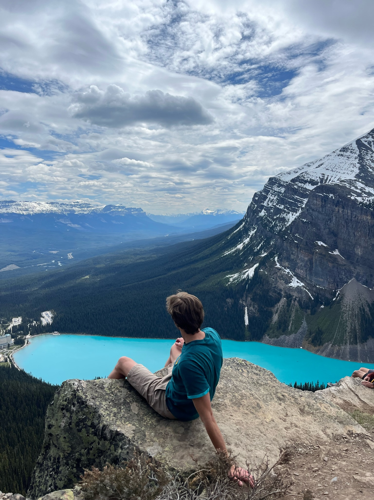

---
hide:
  - toc
---

# Watch my most recent talk!

# Hello,

<figure style="float: right; width: 30%;">
  
  <figcaption>This is me at Lake Louise, Canada.</figcaption>
</figure>

I'm a mathematician and PhD candidate at Case Western Reserve University. This summer I was also RA at [*topos institute*](https://topos.institute).
I'm interested in exploring ideas in double category theory.
In particular, I want to understand notions of presentable double categories, compact closed double categories and their use in answering questions in category theory and other areas of mathematics.

Recently, I have also been learning how to apply formal methods of category theory to real world problems.

Beyond this, I am drawn to all ideas that explore the search for truth and the beauty it reveals.

On this website, you'll find:

- [**About me**](aboutme/index.md): A description of my given talks, papers and events I helped organize.
- [**Conversations with friends**](blog/cv.md): I like thinking about things and having long conversations with others about things.
In this section I want to keep a record of some of the things thought and conversated.

If you find something here that resonates with you, you want to collaborate on a project or just want to say hello; feel free to reach out to me at [axh1127@case.edu](mailto:axh1127@case.edu).

# Friends

[*Sebastian Gómez Rendón*](https://sites.google.com/view/sebasgomez)

[*Shiv Mauree*](https://smauree.com)

[*Nikolas Rieke*](https://www.iaa.tu-bs.de/nikrieke/)
