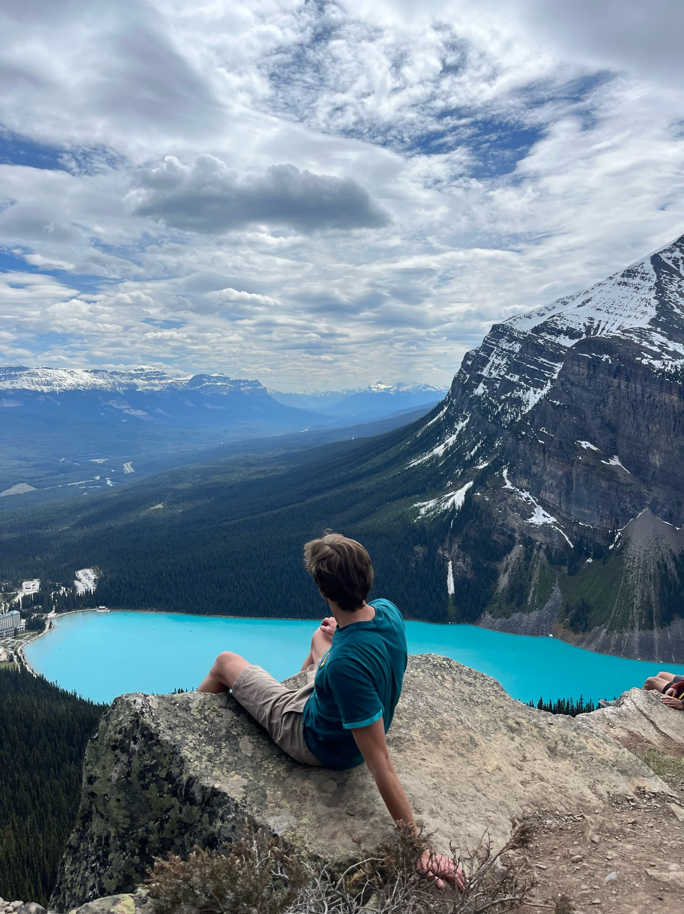

---
hide:
  - toc
---

# Welcome to My Homepage

<figure style="float: right; width: 30%;">
  
  <figcaption>This is me in Lake Louise, Canada.</figcaption>
</figure>

Hello! I'm a mathematician and PhD candidate at Case Western Reserve University. My primary interests lie in category theory and homotopy theory, as well as their applications in algebra and topology. Beyond these, I am drawn to all ideas that explore the search for truth and the profound beauty it reveals.

Here, you'll find:

- **About Me**: Learn more about my interests, teaching experiences, and publications (pending).
- **Mathematical Notes**: A collection of notes documenting my mathematical journey—ranging from polished to exploratory.

If you find something here that resonates with you, feel free to reach out to me at **axh1127 [at] case [dot] edu**.

